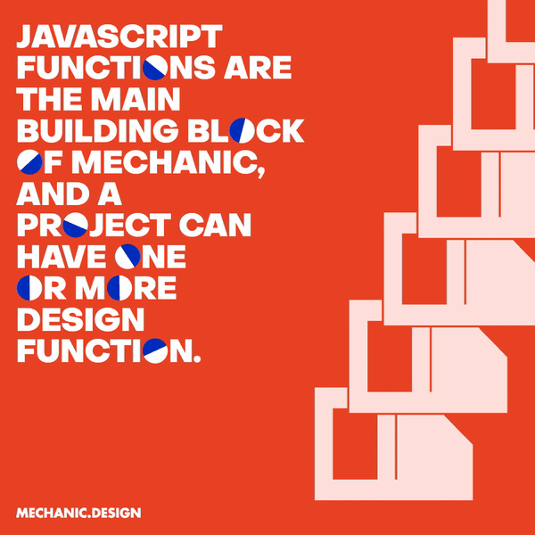

# ✨ Mechanic 2.0 ✨ Examples!

The four examples here serve as both design and technical tutorials. They showcase what Mechanic.design can do, but weren’t explored enough. Two of the examples are done in p5 and two are in SVG.

## Mechanic This Sticker (SVG)


This is a simple example to show how powerful Mechanic is in creating tools with image. Here we domenstrate how to do image uploading, filtering and masking function, even pixel and vector dual exports.

You can use it to create your own sticker generator or any idea that plays with images!

### Image Upload

First, we have to add an image upload input in the sidebar by writing:

```js
export const inputs = {
  image: {
    type: "image",
    multiple: false,
  },
};
```

In order to get the image URL, we will have to rely on `useEffect` and `useState` in react, and create states for `href` and `setHref`. The user uploaded image will be loaded in as an object `image` as we have previously defined. By creating a new `FileReader()` and utilizing its `readAsDataURL` function we can successfully generate an URL for the image and send that it as the parameter `href` into our React SVG code.

```js

import React, { useEffect, useState } from "react";

const [href, setHref] = useState("");

useEffect(() => {
let reader;
if (image) {
    reader = new FileReader();

    reader.readAsDataURL(image);

    reader.onload = function () {
    setHref(reader.result);
    };

    reader.onerror = function () {
    console.error(reader.error);
    };
}
return () => {
    if (reader) {
    reader.abort();
    }
};
}, [image]);

useEffect(() => {
if (!image || href !== "") {
    Mechanic.done();
}
}, [image, href]);
```

In the SVG we will simply have to write something like to show our image:

```HTML
<image width="100%" height="100%" href={href}/>
```

Since there isn't a default value for our image object, if we want to use a default image for the preview before the user uploads any image we can simply do a shorthand if statement here such as:

```HTML
<image width="100%" height="100%" href={href? href: "https://images.unsplash.com/photo-1648254795567-0112e5d29a97?ixlib=rb-1.2.1&ixid=MnwxMjA3fDB8MHxwaG90by1wYWdlfHx8fGVufDB8fHx8&auto=format&fit=crop&w=687&q=80"}/>
```

Here we are borrowing an image from [unsplash](https://unsplash.com/) using an aboslute external link. 

### Image Masking

The next step is masking our image so that it'll be cropped in a half-circle shape. We define our mask in the `defs` wrap so it'll only render when required or when it is called. We also give it a unique ID `image-mask`.

```HTML
<defs>
    <mask id="image-mask">
    <g transform={`translate(${width/2} ${height/2}) `} >
    <path d={`M ${-circleRadius} 0 A ${circleRadius} ${circleRadius}, 0, 0, 0, ${circleRadius} 0 Z`} fill="white"/>
    </g>
    </mask>
</defs>
```

So then we can points the masking clip of our image to that id by doing `mask="url(#theid)"` like this:

```HTML
<image width="100%" height="100%" transform={`translate(${-width/2} ${-height/2})`}
preserveAspectRatio="xMidYMid slice"
href={href? href: "https://images.unsplash.com/photo-1648254795567-0112e5d29a97?ixlib=rb-1.2.1&ixid=MnwxMjA3fDB8MHxwaG90by1wYWdlfHx8fGVufDB8fHx8&auto=format&fit=crop&w=687&q=80"}
mask="url(#image-mask)"/>
```

You can use `transform` to control how the image will move inside the masking clip. We also put a `preserveAspectRatio` here so we don't stretch the image when rescaling.

You can read more about SVG masking and clipping [here](https://developer.mozilla.org/en-US/docs/Web/SVG/Tutorial/Clipping_and_masking) in MDN.

### Image Filtering

The last step is to filter the image so the front texts can be more legible even with a really colorful background image. Here we demonstrate a no-brainer where you just create another half circle with adjustable opacity, and place it on top of where the masked image is.

```HTML
<path d={`M ${-circleRadius} 0
         A ${circleRadius} ${circleRadius}, 0, 0, 0, ${circleRadius} 0 Z`}
         fill={colorTwo} style={{mixBlendMode: "multiply"}} opacity={filterOpacity/100}/>
```

Notice how we put an embedded CSS style `mixBlednMode` here. There are multiple mix blend modes, each with different effects on how it'll serve as a filter. You can find out more about them [here](https://developer.mozilla.org/en-US/docs/Web/CSS/mix-blend-mode).


### Multiple Export
One exciting new feature in Mechanic 2.0 is that now we support multiple exports! By simply doing:

```js
export const settings = {
  engine: require("@mechanic-design/engine-react"),
  showMultipleExports: true,
};
```

You will see that since SVG is vector based and scalable, it could be downloaded as simply SVG or rendered as pixels and downloaded as PNG.

## Replace "O" Poster (p5)



This example shows how Mechanic can be used to support a strong identity system. It will automatically replace all the letter Os in user input with spinning Mechanic logos and renders the video file fast. Such a motion identity system used to be tedious to maintain but could be done easily with the aid of Mechanic.

Technically it demonstrates line-breaking, string manipulation, and embedded illustration with the Mechanic p5-template.

### line-breaking
We first calculate the `canvasRatio` so we can adjust the max length of a sentence according to the ratio. Then we write an algorithm that would determine whether we should glue two words together or not.

```js
const raw = tagline.split(" ");

let holder = []; // Output
for (var i = 0, j = raw.length - 1; i <= j; i++) { // Iterate all but last (last can never be glued to non-existing next)
let curr = raw[i]; // This piece
let next = raw[i + 1]
if (next) {
    if (curr.length + next.length < maxText) { // If its length is smaller than 3
    curr += ' ' + raw[++i]; // ... glue with next and skip next (increment i)
    }
}
holder.push(curr.toUpperCase()); // Add to output
}
const lines = [...holder]
```

The logic is to read the input text as an array of individual words by using `.split()` to break them. Then we write a for loop to calculate if the lengths of two adjacent elements in the array are short enough to be glued together. 

For instance, with an array like `['this','cat', 'is', happy]`, the algorithm will possibly glue it as `['this cat', 'is happy']`.

# string manipulation
In the p5 code, we will do another if statement to determine whether each string element of this newly glued array includes any "O" or not. If it does then we will split it into an array and take out the "O". For instance, a string "Ontology" with many Os will become an array like this ["O", "NT", "O", "L", "O", "GY"]. 

```js
if (lines[i].includes("O")) {
    let arr = lines[i].split(/(O)/g);}
```

Then we will use this new array `arr` to determine whether we should draw out the word or the mechanic logo in p5 by an if statement.

```js
if (arr[j] != "O") {
/// draw the text
} else {
/// draw the logo
}

widthSum += sketch.textWidth(arr[j]);
```

The trick here is to use p5's `textWidth` that will calculate the width of any text element so we can precisely determine the x position we will place our mechanic logo instead of the letter O.

### Embedded Illustration
The last demo shows how to put some intricate illustrations in p5, and especially, how to automate the process. It's no magic. We used this awesome tool [svg2p5](https://github.com/ygev/svg2p5) to translate our svg drawings into p5 shape functions.  Then we just make them into different functions and use `switch` with the mechanic option input for the user to toggle between different illustrations.

```js
switch (backgroundImage) {
      case 'files':
        fileShape(bgImage.x, bgImage.y, bgImage.num);
        break;

      case 'circles':
        circleShape(bgImage.x, bgImage.y, bgImage.size, bgImage.rotate, bgImage.num, bgImage.strokeWeight);
        break;

      case 'export':
        exportShape(bgImage.x, bgImage.y, bgImage.num, bgImage.strokeWeight);
        break;

      default:
        break;
}

backgroundImage: {
    type: "text",
    default: 'files',
    options: ['files', 'circles', 'export']
}
```

## Matter Mechanic (p5)


This example shows how to combine Mechanic with external javascript libraries like [matter.js](https://brm.io/matter-js/) that supports customizable physics engines. It shows that Mechanic is a framework, a blank canvas that you can splash any of your wildest creativity on it! 

Not only Mechanic can be used other creative coding libraries such as [RiTaJS](https://rednoise.org/rita/), [ml5.js](https://ml5js.org/) and many more!

### Import A New Library

To import a new library matter.js you can simply do:
```
npm install matter-js
```

And write this on the top of your sketch.js file:
```js
import * as Matter from 'matter-js'
```

Viola! It's done.
We will not go through how to write a matter.js code as you can find out more about it [here](https://brm.io/matter-js/docs/) in its documentation. 

### Control p5 Animation with Seconds

We will instead show you how to use `seconds` to control the export setting of a p5 animation. If you only want an animation with 15 seconds, you can use the p5's `millis()` function:

```js
if (sketch.millis() / 1000 < 15) {
    mechanic.frame();
} else {
    mechanic.done();
}
```

You can also make seconds an input variable so the user can decide how many seconds of the animation they will like it to export. 

## Adaptive Grid (SVG+ HTML)


This example shows a really powerful side of Mechanic, that we can use Mechanic with ALL the web technologies we know! Not only we can manipulate HTML Canvas or SVG code, but we can also use ‘foreign objects’ to mix HTML and CSS with SVG so we can style them more intuitively. It also demonstrates the concept of adaptive grid, with image masking and custom toggle buttons.

### Text Wrap with Foreign Objects
The idea of text wrap is that, unlike SVG text objects, it can automatically break the line and wrap the text based on the content, the width of the text wrap, the padding and gutter like in HTML. So here we create an `<foreignObject>` to mix HTML code with SVG.

```js
<foreignObject width={oneWidth} height={fullHeight} x={borderRatio} y={borderRatio}>
    <div className={columnClass} >
        <div className="top" style={bigTextStyle}>
            <p>{textOne}</p>
            {canvasRatio >= 0.5?<></> :
            <><br /><p>{textFour}</p></>}
        </div>

        <div className="bottom" style={textStyle}>
            <p>{textTwo}</p>
            {canvasRatio >= 0.5?<></> :
            <><br />
        <p>{textThree}</p></>}
        </div>
    </div>
</foreignObject>`
```

Here we create one column `div` with a top and bottom part, both with some paragraphs in it. We can style our paragraphs in two ways. We can do it in the css.

```js
import './styles.css';
```

```css
.column{
    height: 100%;
    position: relative;
    padding: 10px;
}

.top {
    position: absolute;
    top: 0;
    padding-top: 10px;
    padding-right: 10px;
}

.bottom {
    position: absolute;
    bottom: 0;
    padding-bottom: 10px;
    padding-right: 10px;
}
```

Or we could style it in our `sketch.js` code so the styles are not fixed but adaptive based on how the user inputs.

```js
const bigTextStyle = {
color: titleColor,
fontSize: textSizeRatio*1.5,
fontFamily: "Object Sans",
whiteSpace: 'pre-wrap',
overflowWrap: "anywhere",
hyphens: "auto"
};
```

The CSS style `overflowWrap` will determine how the texts are wrapped, here we use "anywhere" so the text doesn't exceed our grid even with a really long word.

### Adaptive Grid
How is the grid adaptive? First, the grid is flexible. We set up three input parameters `columnOneRatio`, `columnTwoRatio`, `columnThreeRatio` so the user can adjust how much space each column should take. The ratios are then calculated and will be used to adjust the width of each column.

```js
const ratioSum = (width-borderRatio*2-gutterRatio*(columnOptions-1)) / (columnOneRatio + columnTwoRatio + columnThreeRatio)
const oneWidth = ratioSum * columnOneRatio
const twoWidth = ratioSum * columnTwoRatio
const threeWidth = ratioSum * columnThreeRatio
```

But what really makes it adaptive is the conditional statements in our foreign objects that serve as our "media-queries" here. 

```js
<foreignObject width={twoWidth} height={fullHeight} x={chooseX[1]+gutterRatio*0.5} y={borderRatio}>
        <div className={columnClass} style={textStyle}>

          {canvasRatio >= 0.75?
          <></> :
          <div className="top" style={bigTextStyle}>
            <p>{textFour}</p>
          </div>}

          <div className="bottom" style={textStyle}>
              <p>{textThree}</p>
          </div>
        </div>
</foreignObject>
```

Just like how Responsive Web Design works in HTML and CSS, we use Mechanic to build a responsive design that will determine how many columns should be used based on the `canvasRatio` of the design.

If it's a long horizontal banner it will have three columns; if it's an Instagram story then maybe two columns; if it's a very long ticket then one column is enough.

### Custom Toggle Button
This is also a new feature in Mechanic 2.0! You can now create your own customized input element. Here we create a toggle button for our adaptive grid because there are just way too many parameters in a grid system.

If you want to see how we create this customized input element, you can find out more in the `inputs/group/index.js` file. Here we're gonna focus on how to use it in Mechanic mostly.

```js

randomRatio: {
    type: "groupToggle",
    default: true,
    label: "Random Ratio",
    inputs: {
      columnOneRatio: {
        type: "number",
        slider: true,
        default: 2,
        min: 1,
        max: 10,
        step: 1,
      },
      ...
      }
    },
  },

```

Here we create a toggle button `randomRatio` with a default of `true`. It has other inputs like `columnOneRatio` as its child. The idea is that if the toggle button stays true then it will gives random values to all of its children, otherwise the user can adjust the value of each specific child themselves.

The following code shows how to do it when we define the child parameter using a shorthand if statement.

```js
const columnOneRatio = randomRatio.show? parseInt(2 + Math.random() * 8) : randomRatio.columnOneRatio;
```

## Start your mechanic project

If you haven't already, move your working directory to this project to run Mechanic commands:

```
cd path/to/project
```

## Running design functions

To run and see your design functions in action right away, just call:

```
npm run dev
```

This will bundle and serve in place a web app that you can open and interact with in your own browser. That way you can test out the code of you design functions, start prototyping assets and exporting them.

Alternatively, you can first built the app, which will generate a folder with the code transformed:

```
npm run build
```

And to serve that already built app and interact with it in a browser, run:

```
npm run serve
```

## Adding new design functions

There's two ways of doing it. First, running a command that will ask you a couple of questions to create a new design functions from a base (template, example or blank):

```
npm run new
```

The other way is to do it manually. Add a new folder in your design functions directory, and add there a `index.js` file. There you should define all necessary exports of a design function. Also, you should add all dependencies that your new design function would use, including its engine. Note that all these steps is done by the previous command.

## More Mechanic

To learn about what can be done and how to do it through Mechanic, visit the [documentation site](https://Mechanic.design/docs).
